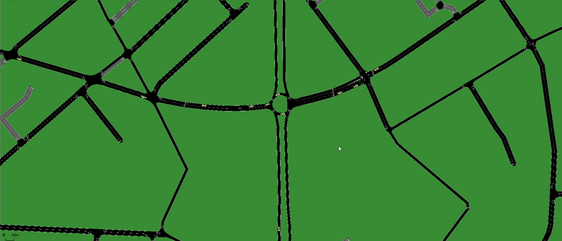

# LS2N SUMO Logistics Simulator 🚛

A Python-based framework using SUMO (Simulation of Urban MObility) to simulate truck logistics operations within a defined road network. It features a GUI for configuration and launching, real-time monitoring, and mission management for individual trucks.




## Overview

This project provides a platform to:

1.  **Create Simulation Instances:** Define scenarios with a specific number of trucks, vehicle types, and mission sets based on map metadata.
2.  **Run SUMO Simulations:** Launch SUMO with the generated configuration using TraCI (Traffic Control Interface) for dynamic control.
3.  **Manage Truck Missions:** Assign and track multi-step missions for trucks (e.g., Go -> Load -> Park -> Unload -> Go).
4.  **Monitor Simulation:** Observe real-time truck status (location, speed, current action, waiting time) in a dedicated monitor window.
5.  **Collect Data:** Generate reports on vehicle performance, emissions (CO2, NOx), waiting times, and distance travelled.

## Features ✨

*   **Graphical User Interface (Tkinter):** Easy configuration of simulation parameters (Map, Truck Count, Vehicle Type, Launch Mode).
*   **Instance Creation:** Generates SUMO route (`.rou.xml`) and mission (`.mis.xml`) files.
*   **Dynamic Mission Control:** Uses TraCI (`Starter.py`) to assign mission steps and react to simulation events (e.g., arrival at destination, parking full).
*   **Real-time Monitoring:** Separate GUI window (`monitor_gui.py`) displays live truck data during the simulation.
*   **Configurable Simulation Modes:** Influence simulation behavior (e.g., parking strategies, speed adjustments) via a "Launch Mode" string.
*   **Metadata Driven:** Relies on map-specific metadata (`metaData.xml`) for defining inputs, outputs, parking locations, stops, and mission templates.
*   **Extensible:** Designed to work with different maps defined within the `cases/` directory.
*   **Reporting:** Saves simulation results (overall stats, per-truck data) to CSV files.

## File Structure 📁

```text
.
├── cases/                      # Contains simulation scenarios (maps)
│   └── Nantes/                 # Example map directory
│       ├── MyNetwork.net.xml   # SUMO Network file
│       ├── network.sumocfg     # SUMO Configuration file
│       ├── metaData.xml        # **Crucial:** Map inputs, outputs, parkings, stops, missions templates
│       ├── MyRoutes.rou.xml    # Generated vehicle routes & departures
│       ├── missions.mis.xml    # Generated truck missions
│       └── results/            # Simulation output reports saved here
│           └── Mode111/        # Subdirectory for each launch mode
├── Azure-ttk-theme-main/       # Optional: Theme files for GUI styling
├── Creator.py                  # Logic for creating .rou.xml and .mis.xml files
├── Main.py                     # Main GUI application entry point
├── Starter.py                  # Core simulation runner using TraCI and mission logic
├── monitor_gui.py              # Code for the real-time monitor window
├── myPyLib.py                  # **CRUCIAL EXTERNAL LIBRARY (Needs to be present)** - ...
├── gui_config.json             # Stores last used GUI settings
└── README.md                   # This file
```

## Prerequisites  M️

*   **Python:** Version 3.8+ recommended.
*   **SUMO:** A working installation of SUMO is required.
    *   Download from [SUMO Downloads](https://sumo.dlr.de/docs/Downloads.html).
    *   **Crucially:** The `SUMO_HOME` environment variable must be set correctly, pointing to your SUMO installation directory (e.g., `C:/Program Files (x86)/Eclipse/Sumo`). The included `sumolib` library is used.
*   **Tkinter:** Usually included with standard Python installations. If not, install it using your system's package manager (e.g., `sudo apt-get install python3-tk` on Debian/Ubuntu).
*   **(Optional) Azure TTK Theme:** If you want the specific GUI styling, download/clone the [Azure-ttk-theme](https://github.com/rdbende/Azure-ttk-theme) and place the `Azure-ttk-theme-main` folder in the project root. If not present, the GUI will use the default system theme.

## Installation & Setup ⚙️

1.  **Clone the repository:**
    ```bash
    git clone https://github.com/thelordofpigeons/LS2N-SUMO-Simulator
    cd <repository-directory>
    ```
2.  **Verify Prerequisites:** Ensure Python and SUMO (with `SUMO_HOME` set) are installed correctly.
3.  **Place `myPyLib.py`:** Make sure the `myPyLib.py` file containing all necessary helper functions is present in the root directory of the cloned repository.
4.  **(Optional) Add Theme:** Place the `Azure-ttk-theme-main` folder in the root directory if desired.
5.  **Check Maps:** Explore the `cases/` directory. The `Nantes` map should be present as an example. Ensure it contains the required files (`.net.xml`, `.sumocfg`, `metaData.xml`).

## Usage ▶️

1.  **Launch the Main GUI:**
    ```bash
    python Main.py
    ```
2.  **Configure Instance Creation:**
    *   Select a `Map Selection` from the dropdown in the "🛠 Create Instance" section.
    *   Enter the desired `Number of Trucks`.
    *   Choose the `Vehicle Type` (`Truck` or `MissionVehicle`).
    *   Check "Run infrastructure only" if you only want non-truck traffic defined in the original `.rou.xml` (truck count will be 0).
    *   Click the `🚀 Create` button. This will generate/update `MyRoutes.rou.xml` and `missions.mis.xml` in the selected map's directory. Progress and success/error messages appear in the log area.
3.  **Launch the Simulation:**
    *   Select the same `Map Selection` in the "🚦 Launch Simulation" section.
    *   Enter a `Launch Mode` string (e.g., `Mode111`). This string controls specific runtime behaviors defined in `Starter.py` (like parking strategy `mode[5]` or speed factor adjustments `mode[6]`). *Refer to the `Starter.py` code (`initMode` function and mission logic) to understand how the mode string is interpreted.*
    *   Click the `🎯 Launch` button.
4.  **Simulation Runs:**
    *   SUMO-GUI should launch automatically.
    *   The "Simulation Monitor" window will appear, showing real-time truck data.
    *   The main GUI remains active. Console output from `Starter.py` will appear in the terminal where you ran `Main.py`.
5.  **Results:** Once the simulation finishes (all trucks complete missions or max steps reached), check the `cases/<MapName>/results/<LaunchMode>/` directory for generated `.csv` report files.

## Configuration & Extension 🔧

*   **Adding New Maps:**
    1.  Create a new subdirectory under `cases/` (e.g., `cases/MyNewCity/`).
    2.  Place your SUMO network file (e.g., `MyNewCity.net.xml`) inside.
    3.  Create a SUMO configuration file (`network.sumocfg`) pointing to your network file and any additional files (like `.add.xml` for detectors, parking areas, etc.).
    4.  **Crucially:** Create a `metaData.xml` file defining input/output edges, parking area details (ID, edge), container stop details (name, edge), and mission templates (sequences of L, U, P, G). Refer to the `Nantes/metaData.xml` and `myPyLib.py`'s `readMeta` function for the expected structure.
    5.  The new map should now appear in the GUI dropdowns.
*   **Customizing Missions:** Modify the mission templates within the relevant `metaData.xml` file. The `Creator.py` script randomly assigns these templates and picks random valid targets.
*   **Simulation Behavior:** Adjust the logic controlled by the `Launch Mode` string within `Starter.py`.
*   **SUMO Parameters:** Modify general SUMO settings in the `network.sumocfg` file for the specific map. Ensure parking areas defined in `metaData.xml` have corresponding definitions (e.g., in an `.add.xml` file included by the `.sumocfg`) and potentially the `parkingArea.capacity` parameter set if using the `isFull` check.

## Known Issues & Limitations ⚠️

*   **External Dependency:** Relies heavily on the non-standard `myPyLib.py`. Its absence will cause errors.
*   **In-Memory State:** Mission progress is tracked in memory by `Starter.py`. If the simulation crashes, this state is lost. The `missions.mis.xml` file is *not* updated during the run.
*   **Hardcoded Values:** Some paths (like the SUMO binary in `Starter.py`) or edge IDs might be hardcoded. Refactoring these into configuration files is recommended for better portability.
*   **Obsolete Code:** `Launcher.py` appears redundant given the `Main.py` -> `Starter.py` workflow and should likely be removed or archived.
*   **Parking Capacity:** The `isFull` check in `Starter.py` depends on the `parkingArea.capacity` parameter being defined for parking areas within the SUMO simulation configuration.

## Contributing 🤝

Contributions are welcome! Feel free to open issues for bugs or feature requests, or submit pull requests with improvements.

